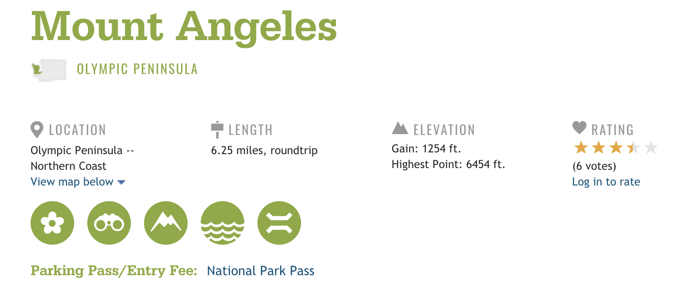

# Trail_Report
## Using machine learning to improve trail accessibility and safety.

### Motivation

As an avid hiker, I’ve spent a lot of time on the [Washington Trail Association](https://www.wta.org/)(WTA) website, scrolling through trail reports to determine current trail conditions. This often ends with little insight gained and a potentially risky decision to make. If I choose to hike, I might get stuck in snow or pick a popular trail with no available parking. 

I realized that I could increase a hiker’s likelihood of checking out a less-popular trail—or any trail at all—by providing the probability of trail and road conditions on an easy-to-access platform. This would thin out trail use, save time, and increase hiker awareness and safety.

### Product:[trail-report.com](http://www.trail-report.com/)

At trail-report.com you can choose a hike from a dropdown list and the date that you want to hike. Trail-report.com then returns the probability that will encounter snow, trail, road, or bug conditions on your hike. 

Currently, the model applies to hikes in the Olympic Peninsula. All Washington State hikes are going to be deployed in the near future, alongside text snippets of relevant past reports.

The website was created using Flask and is self-hosted on AWS.

### Data Used

**Trail Information and Trail Reports:** Scraped through requests and BeautifulSoup from [WTA](https://www.wta.org/). Trail reports began in 1997 and are continuously scraped to keep the model up to date.

Example of scraped trail information:

Example of scraped trail report:

**Weather Trends:** Collected as CSVs from [Climate.gov](https://www.climate.gov/maps-data/dataset/past-weather-zip-code-data-table). Trails connected with closest weather station data by lat/log coordinates.

### Modeling

Due to multiple ways to report warnings of trail conditions on [WTA](https://www.wta.org/), my model is built to work with 4 different y variables:
- Significant Snow
- Poor Road Conditions
- Lots of Bugs/Mosquitos
- Notable Trail Problems

I measured these as boolean values- True if a trail report mentioned a condition. I tried Logistic Regression, Decision Tree, and  Random Forest models. While logistic regression gave insight on the type of correlation features had when determining snow conditions, it performed significantly worse predicting other conditions(snow AUC: .95, other conditions: .65 AUC(avg). Using a random forest model was much more consistent across the board with an average AUC score of: .86. A random forest model was ultimately chosen to best represent the data, and further tuned decreasing the log-loss to a 0.44.

To fill in the gaps on trails with less trail reports, I used KNearestNeighbors. Within each sub-region, hike elevation, distance from a median point, and date were used to determine most similar reports. To capture the date in a non-linear form it was expressed as the cos and sin of the date in radians (with a year representing one circle). With these features, I was able to determine the most relevant past trail reports to use in the model and scaled these reports from 0-1. This model on its own had an AUC of .62, and became an important feature in the final model.

### Access the project

After cloning the repo, the following commands can be run in the terminal from the main folder.

#### Website

`bash run_web_app.sh`

### Future Work
- Add relevant text snippets for each feature, using KNN on past trail reports. This feature is currently in production and will be implemented shortly.
- Apply model to all of Washington. trail-report is currently scaled to scrape and build the model on all WTA reports. Due to the volume of past reports, an AWS EC2 instance or related service is highly recommended for the scraping process. This data is currently being retrieved and will be implemented on the website in the future.
- Combine the model with a recommender system to recommend hikes based on trail conditions and a hiker’s imputed hike preferences.

### Sources 
  1. Washington Trails Association. [WTA](https://www.wta.org/). 
  2. Images on website used with permission from personal sources. 
  3. Jade Tabony's WTA trail recommender system project used as a reference for web scraping - [Repo](https://github.com/Jadetabony/wta_hikes)

