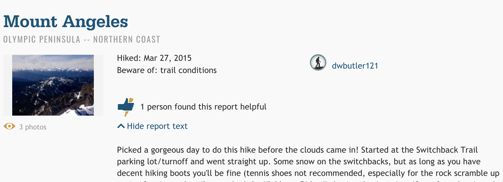

# Trail_Report
## Using machine learning to predict prbability of impactful hiking trail conditions in Washington to increase trail accessibility and safety.

### Motivation

As an avid hiker, I’ve spent a lot of time on [Washington Trail Association's](https://www.wta.org/)(WTA) website, scrolling through trail reports to determine current conditions. This often ends with little insight gained, and a risky decision between possibly getting stuck in snow or hiking a popular trail and hoping for a parking spot. I realized providing the probability of trail and road conditions on an easy to access platform could increase a hiker’s likelihood of checking out a less-popular trail, or any trail at all. This would thin out trail use, save time, and increases hiker awareness and safety.

### Product:[Trail-Report.com](www.trail-report.com)

At trail-report.com you can choose a hike from the dropdown list,select the date you would like to go, and it will return the probabilty another hiker would report snow,trail,road,or bug conditions on your hike. 

Currently, the model is applied to hikes in the Olympic Penninsula. All Washington hikes will be deployed in the near future, alongside text snippits of relivent past reports.

Website created using Flask and self-hosted on AWS.

### Data Used

**Trail Information and Trail Reports:** Scraped through requests and BeautifulSoup from [WTA](https://www.wta.org/). Trail reports begin in 1997 and are continuosly scraped to keep the model up to date.

Example of scraped trail information:

Example of scraped trail report:

**Weather Trends:** Collected as CSVs from [Climate.gov](https://www.climate.gov/maps-data/dataset/past-weather-zip-code-data-table). Trails connected with closest weather station data by lat/log cordinates.

### Modeling

Due to multiple ways to report warnings of trail conditions on [WTA](https://www.wta.org/), my model is built to work with 4 different y variables:
- Significant Snow
- Poor Road Conditions
- Lots Of Bugs/Mosquitos
- Notable Trail Problems

These were measured as boolean values- weather a trail report warned reader of a condition. Logistic Regression, Random Forest, and Gradient boosted models were all tried. While logistic regression gave insight on the type of correlation features had when determining snow conditions, it performed significantly worse predicting other condtions(snow AUC: .95, other conditions: .65 AUC(avg). Using a random forest model was much more consistent across the board with an average AUC score of: .86. A random forest model was ultimatly chosen to best represent the data, and further tuned decreasing the log-loss to a 0.44.

To fill in the gaps on trails with less trail reports, KNearestNeighbors was used. Within each sub-region- hike elevation,distance from a median point, and date. The most important aspect of the date were month and day. To capture the date in a non-linear form it was expressed as the cos and sin of the date in radians (with a year reprenting one circle). With these features, we were able to detemine most relivent past trail reports to the model, and get an average of their report of each condtion. This model on it's own had an AUC of .62, abd became an important feature in the final model.

### Access the project

After cloning the repo the following comands can be run in the termianl from the main folder.

#### Website

`bash run_web_app.sh`

#### Run model in the command line

`python trail_report/build_model/make_all_prediction.py`

This program runs on a pre-set date and hike. To change the date and hike you would like to run. Change the imputs in the main block.

### Future Work
- Add relevent text snipits for each feature using KNN on past trail reports. This feature is currently in production and will be implimented shortly.
- Applying model to all of Washignton. Program is currently scaled to scrape and build the model on all WTA reports. Due to the volume of past reports, an AWS EC2 instance or related service is highly recommeneded for the scraping process. This data is currently being retrieved and will be implimented on the website in the future.
- Combine model with a recomender system to recomend hikers hikes based on their inputed hike preferences and trail conditions.

### Sources 
  1. Washington Trails Association. [WTA](https://www.wta.org/). 
  2. Images on website used with permission from personal sources. 
  3. Jade Tabony's WTA trail recomender system project used as a reference for webscraping - [Repo](https://github.com/Jadetabony/wta_hikes)
